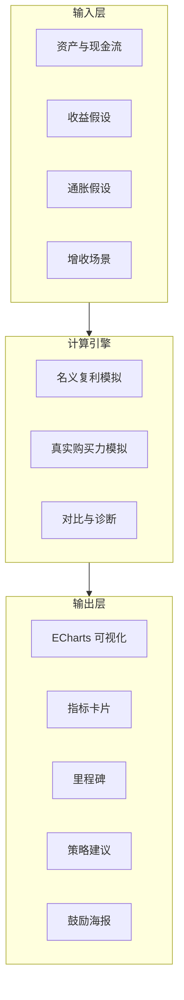
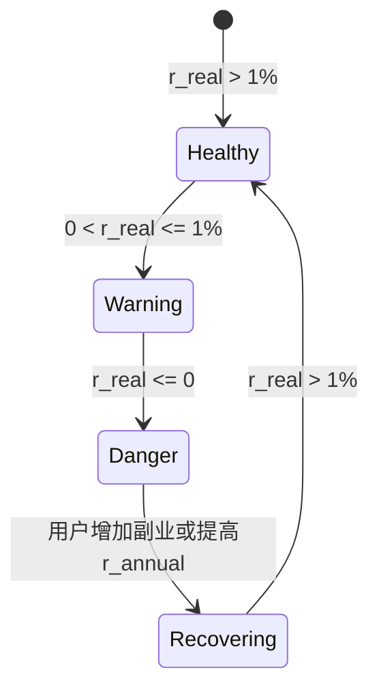
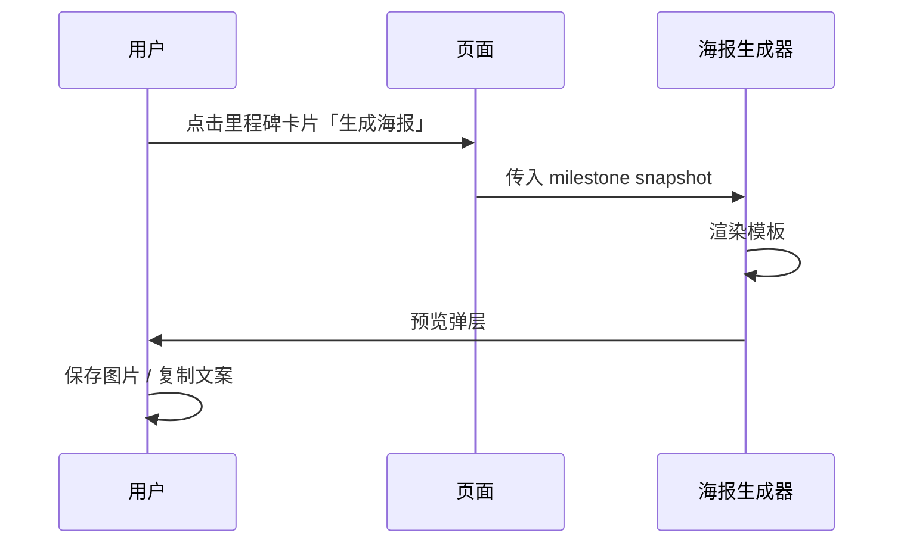

# 复利滚雪球 · 产品需求文档（PRD）

| 字段 | 内容 |
|------|------|
| **文档版本** | v1.2.1 |
| **创建日期** | 2026-05-17 |
| **最近更新** | 2026-05-20 |
| **产品代号** | Compound Snowball / 复利滚雪球 |
| **所属体系** | 极客兔（jiketu）工具与认知产品矩阵 |
| **关联原型** | [`docs/src/public/example/复利可视化.html`](../public/example/复利可视化.html) |
| **文档状态** | 草案 · 供研发与 AI 协作对齐 |

---

## 1. 修订记录

| 版本 | 日期 | 作者 | 说明 |
|------|------|------|------|
| v1.0 | 2026-05-17 | 产品/极客兔 | 整合对话、原型迭代与通胀/海报等新需求，首版 PRD |
| v1.1 | 2026-05-17 | 研发/极客兔 | 落地 v1.0–v1.2 原型能力；补充默认值规范与 PRD 内省章节 |
| v1.2 | 2026-05-19 | 研发/极客兔 | 成就证书版式重设计、短期里程碑、亮暗主题与响应式；§22 复盘更新 |
| v1.2.1 | 2026-05-20 | 研发/极客兔 | 证书视觉精简：去标题区三角装饰；页脚品牌文案与居中规范 |

---

## 2. 产品概述

### 2.1 一句话定义

**复利滚雪球**是一款帮助普通人建立「复利 + 真实购买力 + 主动增收」认知的**财务可视化与行为激励工具**：用可交互的曲线与里程碑，把抽象的财富增长讲清楚；在通胀侵蚀购买力时给出可执行的应对思路；在关键节点生成可分享的鼓励海报，强化长期坚持。

### 2.2 产品本质（不是理财 App）

| 是 | 不是 |
|----|------|
| 认知与教育工具 | 证券开户 / 基金销售 |
| 参数化模拟与对比 | 实时行情或投顾建议 |
| 行为激励（里程碑、海报） | 强制记账或预算管理 |
| 诚实披露假设与局限 | 承诺收益或保本 |

### 2.3 与极客兔生态的关系

- 站点 [`docs/src/02.产品/index.md`](index.md) 已承载「工具箱」类产品入口（如 `UtilityTools`）。
- 本产品是**独立子产品**，可嵌入 VitePress 文档站（iframe / 独立路由），也可演进为独立 H5 / 小程序。
- 视觉与「极客兔工具箱」等原型保持**现代深色 + 金色强调**的品牌一致性，但避免复古拟物金币风。

---

## 3. 背景与要解决的问题

### 3.1 用户认知缺口

多数人「知道复利」，但缺乏直觉：

1. **时间**：坚持 10 年 vs 15 年，后期斜率差异有多大？
2. **储蓄率**：每天收入里存下 10% 与 30%，长期差距如何？
3. **收益假设**：年化 5% / 8% / 12% 对结果影响非线性。
4. **名义 vs 真实**：账面资产上涨，若通胀高于实际收益率，**购买力可能在缩水**——这是教科书很少讲透、却与生活强相关的一点。
5. **行动缺口**：当「存了却在贬值」时，仅调参数无法解决，需要**扩大本金来源**（副业、技能变现、多收入流等）。

### 3.2 现有原型已验证的方向

通过 [`复利可视化.html`](../public/example/复利可视化.html) 多轮迭代，已验证：

- 参数滑块 + 即时反馈的交互模式有效；
- **ECharts** 轴触发 Tooltip 比 Canvas 手绘更易读；
- 现代 Fintech 暗色 UI 优于复古金色拟物；
- 用户明确需要：**通胀、增收策略、里程碑海报** 纳入同一叙事。

### 3.3 核心矛盾（产品要正面回答）

> **名义复利 ≠ 真实财富增长**  
> 当 `实际收益率 ≈ 名义收益率 - 通胀率`（简化模型）≤ 0 时，「只存钱+低收益」可能在**购买力意义上贬值**。  
> 产品既要展示「理想复利曲线」的激励，也要展示「真实曲线」的清醒，并引导用户进入**增收与提收益率**的策略层。

---

## 4. 产品定位与价值主张

### 4.1 定位语句

**面向有储蓄习惯、但缺乏财务直觉的年轻职场人与副业探索者**，提供「算得清、看得懂、愿意坚持、知道通胀时该怎么办」的复利认知伴侣。

### 4.2 价值主张（三句话）

1. **看见时间的力量**：三条曲线对比（复利总资产 / 只存钱 / 累计投入）。
2. **看见通胀的侵蚀**：名义资产 vs 通胀调整后购买力（规划能力）。
3. **看见行动的路径**：当真实收益为负或偏低时，推荐可配置的「增收场景」，并庆祝里程碑。

### 4.3 差异化

| 维度 | 典型复利计算器 | 本产品 |
|------|----------------|--------|
| 叙事 | 单次计算结果 | 全周期曲线 + 里程碑 |
| 真实世界 | 常忽略通胀 | 通胀与真实收益为核心模块 |
| 行动 | 无 | 增收策略与海报激励 |
| 调性 | 表格/银行风 | 现代金色工具风 + 认知文案 |

---

## 5. 目标用户与场景

### 5.1 用户画像

| 画像 | 特征 | 核心动机 |
|------|------|----------|
| **P1 储蓄觉醒者** | 22–35 岁，有工资，刚开始定投/存款 | 想知道「坚持 10 年大概多少」 |
| **P2 副业探索者** | 有主业，尝试自媒体/接单/第二职业 | 想对比「多一份收入」对曲线的拉动 |
| **P3 认知分享者** | 爱写成长类内容、朋友圈打卡 | 需要里程碑海报传播 |
| **P4 内容创作者（站主）** | 极客兔博客读者 | 在文章内嵌工具强化观点 |

### 5.2 典型场景（User Stories）

| ID | 作为… | 我想要… | 以便… |
|----|--------|---------|--------|
| US-01 | 储蓄觉醒者 | 输入日收入、储蓄比例、年化收益、年限 | 看到期末资产与复利占比 |
| US-02 | 储蓄觉醒者 | 悬停图表任意月份 | 看到该月名义资产、投入、复利收益 |
| US-03 | 理性用户 | 设置通胀率 | 看到「名义资产」与「购买力等价资产」的差距 |
| US-04 | 理性用户 | 当真实收益≤0 时 | 收到明确警示与增收建议，而非盲目乐观 |
| US-05 | 副业探索者 | 增加「副业月收入」等输入 | 看到扩大本金后曲线抬升幅度 |
| US-06 | 分享者 | 到达 1/3/5/10 年等里程碑 | 生成鼓励海报并保存/分享 |
| US-07 | 所有用户 | 看到免责声明 | 明白这是教育模拟，非投资建议 |

---

## 6. 产品目标与成功指标

### 6.1 业务目标（6–12 个月）

1. 成为极客兔站内**高停留**工具页之一（嵌入成长/理财类文章）。
2. 里程碑海报带来**自然分享**（朋友圈、小红书、公众号配图）。
3. 为后续「番茄钟 / 工具箱」等产品提供**统一账户与数据**扩展点（可选）。

### 6.2 成功指标（可量化）

| 指标 | 定义 | 初期目标 |
|------|------|----------|
| 工具完成率 | 调整≥3 个参数并停留>60s | ≥ 40% UV |
| 图表交互率 | 触发过 Tooltip / 缩放 | ≥ 55% |
| 海报生成率 | 点击「生成海报」并成功导出 | ≥ 8% |
| 分享率 | 海报保存或复制链接 | ≥ 3% |
| 警示触达率 | 真实收益≤0 时展示策略卡片的曝光 | 100% 命中 |

### 6.3 非目标（本期不做）

- 对接券商、基金申购、自动同步银行流水；
- 精确税务、各地医保公积金规则；
- 投资建议与具体产品推荐排名。

---

## 7. 核心概念与术语

| 术语 | 定义 |
|------|------|
| **名义总资产** | 按用户给定年化收益率、月末定投、按月复利计算出的账面金额 |
| **累计投入** | 期初本金 + 各月定投之和（不含收益） |
| **名义复利收益** | 名义总资产 − 累计投入 |
| **只存钱曲线** | 无投资收益，仅累加定投（对比基线） |
| **通胀率** | 用户给定的年化 CPI 假设（默认建议 2%–3%，可自定义） |
| **购买力资产（真实资产）** | 将各期名义现金流用通胀折现或期末等效购买力修正后的序列（见 §9.2） |
| **实际收益率（简化）** | `名义年化收益率 − 通胀率`（首版可用 Fisher 近似；进阶版见 §9.2） |
| **增收项** | 用户额外录入的月收入（副业、兼职等），计入月定投能力 |
| **里程碑** | 预设时间点（1/3/5/10/15/20/30 年）上的资产与文案节点 |
| **鼓励海报** | 基于里程碑数据生成的静态分享图（PNG/WebP） |

---

## 8. 功能需求总览

### 8.1 模块地图



### 8.2 功能清单与优先级

| 模块 | 功能 | 优先级 | 原型状态 |
|------|------|--------|----------|
| F1 参数输入 | 已有资产、日收入、储蓄比例、年化收益、规划年限 | P0 | ✅ 已实现 |
| F2 名义模拟 | 月末定投 + 月复利；三曲线 | P0 | ✅ 已实现 |
| F3 图表 | ECharts 折线、Tooltip、图例、十字准星 | P0 | ✅ 已实现 |
| F4 指标卡 | 期末资产、投入、复利收益、较只存钱多赚、月定投 | P0 | ✅ 已实现 |
| F5 文案洞察 | 动态鼓励段落（坚持 N 年、再多 5 年等） | P1 | ✅ 已实现 |
| F6 里程碑列表 | 1/3/5/10… 年节点金额 | P1 | ✅ 已实现 |
| F7 通胀模块 | 通胀率输入；名义 vs 购买力双轨 | P0 | ✅ v1.0 |
| F8 真实收益诊断 | 实际收益率≤0 警示与说明 | P0 | ✅ v1.0 |
| F9 增收场景 | 副业月收入计入定投 | P1 | ✅ v1.1 |
| F10 策略库 | 通胀>收益时的行动建议卡片 | P1 | ✅ v1.0（warning/danger 展示） |
| F11 里程碑海报 | Canvas 模板、预览、PNG 下载 | P1 | ✅ v1.2 基础版 |
| F12 数据持久化 | localStorage 记住上次参数 | P2 | ✅ 已实现 |
| F16 名义/购买力 Tab | 主指标切换视图 | P1 | ✅ v1.0 |
| F17 假设说明 | details 折叠披露公式 | P1 | ✅ v1.0 |
| F13 场景预设 | 「保守/中性/乐观」一键填充 | P2 | ❌ 未实现 |
| F14 时间轴缩放 | ECharts dataZoom 长周期 | P2 | 可选 |
| F15 嵌入模式 | VitePress 组件 / iframe 参数 | P2 | 部分可用 |

---

## 9. 计算模型与业务规则

### 9.1 名义复利模拟（当前原型逻辑 · P0 基线）

**输入：**

- `P0`：期初已有资产（元）
- `d`：每日收入（元）
- `s`：储蓄比例（0–1）
- `r_annual`：名义年化收益率（小数，如 0.08）
- `Y`：规划年限（年）

**派生：**

- 月定投：`M = d × 30 × s`（首版固定 30 天/月，PRD 保留后续改为「工作日/自定义」扩展位）
- 月利率：`r_m = r_annual / 12`

**逐月（t = 1 … 12Y）：**

1. 月初余额参与复利：`B' = B_{t-1} × (1 + r_m)`
2. 月末投入：`B_t = B' + M`（及可选增收 `M_extra`）
3. 累计投入：`C_t = C_{t-1} + M (+ M_extra)`
4. 只存钱基线：`S_t = S_{t-1} + M (+ M_extra)`（收益率为 0）

**输出序列：** 每月 `(t, B_t, C_t, S_t)` 供图表与里程碑使用。

**免责声明（界面固定展示）：** 示意计算，非投资建议；未含税费、市场波动、产品申赎规则。

### 9.2 通胀与真实购买力（规划 · P0）

首版推荐 **两种展示模式**（可 Tab 切换「名义视图 / 真实视图」）：

#### 模式 A：实际收益率近似（实现简单，适合 MVP）

- 用户输入通胀率 `i_annual`（默认 2.5%）
- `r_real ≈ r_annual − i_annual`（可在 UI 标注为简化公式）
- 用 `r_real` 再跑一遍 §9.1 引擎 → 得到 **购买力等价资产曲线**
- 若 `r_real ≤ 0`：触发 **警示状态**（见 §10）

#### 模式 B：通胀折现（更准确，P1+）

- 维护名义资产序列 `B_t`
- 购买力：`B_t^real = B_t / (1 + i_m)^t`，其中 `i_m = i_annual/12`
- 图表增加第四条曲线：**购买力等价资产**

**对比指标：**

| 指标 | 公式/说明 |
|------|-----------|
| 名义期末资产 | `B_T` |
| 真实期末购买力 | `B_T^real` 或 模式 A 期末值 |
| 购买力缩水额 | `B_T - B_T^real`（名义−真实） |
| 是否「存了却贬值」 | `r_real ≤ 0` 或 `B_T^real < C_T` |

### 9.3 增收场景（规划 · P1）

**动机：** 当通胀≥收益时，仅提高储蓄比例无法从根本上改善 `r_real`；需提高 **定投现金流 M**（扩大本金来源）。

**输入项（可叠加）：**

| 字段 | 说明 | 默认值 |
|------|------|--------|
| 主业日收入 | 已有 `d` | — |
| 副业月收入 | 自媒体、接单等 | 0 |
| 其他月收入 | 租金、分红等 | 0 |
| 副业储蓄比例 | 可与主业不同 | 同 `s` |

**计算：**

- `M_total = d×30×s + side_monthly×s_side + other_monthly×s_other`
- 图表支持 **对比条**：「无副业 vs 有副业」两条名义曲线，或阴影区域表示增收贡献。

**策略卡片（非自动财务建议，而是教育文案）：**

- 扩大收入来源：副业、技能变现、兼职；
- 提升可投资收益率：学习资产配置（仅概念，不推荐具体产品）；
- 提高储蓄率：在收入固定时的次优解；
- 降低支出通胀敏感：可选提示，P2。

### 9.4 里程碑规则

**近期节点（月/天，插值）：** 7 天后、一月后、3 月后、6 月后（`months ≤ 规划年限×12` 时展示；曲线在整月样本间线性插值）。

**年度节点（年）：** 1, 3, 5, 10, 15, 20, 30（超过规划年限的隐藏）。

**每个节点展示：**

- 名义总资产 `B_t`
- 购买力等价资产 `B_t^real`（通胀开启后）
- 名义复利收益 `max(0, B_t − C_t)`
- 操作：「领取成就证书」→ 生成竖版 PNG

**触发海报的里程碑类型：**

| 类型 | 条件 | 海报主题示例 |
|------|------|--------------|
| 时间型 | 满 N 年规划预览 | 「10 年后的你」 |
| 金额型 | 名义资产首次突破 10万/50万/100万 | 「踏入六位数」 |
| 比例型 | 复利收益占资产 >30% | 「复利过半」 |
| 逆转型 | 从 `r_real≤0` 调到 `>0` | 「跑赢通胀」 |

---

## 10. 通胀警示与策略引导（详细需求）

### 10.1 状态机



### 10.2 UI 行为

| 状态 | 条件 | 界面表现 |
|------|------|----------|
| **健康** | `r_real > 1%` | 金色主曲线；洞察文案偏激励 |
| **注意** | `0 < r_real ≤ 1%` | 顶部琥珀色提示条；建议检查通胀假设 |
| **危险** | `r_real ≤ 0` | 红色/琥珀警示卡片；默认展开「增收策略」；名义曲线仍展示但加「购买力」对比 |
| **恢复** | 用户调整参数使 `r_real > 0` | Toast「已跑赢通胀（模拟）」+ 可选海报 |

### 10.3 策略内容库（首版文案结构）

每条策略包含：`icon` + `标题` + `2 行说明` + `可选行动按钮（链到博客/外链）`

1. **扩大本金：副业与自媒体** — 将流量与技能转化为第二现金流，直接提高月定投。
2. **扩大本金：提升主业收入** — 跳槽、晋升、接单；一次性提高 M。
3. **提升名义收益率** — 在风险可承受前提下优化储蓄方式（教育性描述，无产品链接）。
4. **提高储蓄比例** — 当短期无法增收时的缓冲手段。
5. **通胀教育** — 解释 CPI、名义 vs 实际；引导用户合理假设 `i_annual`。

---

## 11. 可视化与交互需求

### 11.1 图表（ECharts · 已落地基线）

| 需求 ID | 描述 | 状态 |
|---------|------|------|
| CH-01 | 三条曲线：复利总资产、只存钱、累计投入 | ✅ |
| CH-02 | `axis` Tooltip：时间点、各曲线金额、复利收益 | ✅ |
| CH-03 | 十字准星 + 虚线 axisPointer | ✅ |
| CH-04 | 图例切换系列显隐 | ✅ |
| CH-05 | 平滑曲线 + 复利资产面积渐变 | ✅ |
| CH-06 | X 轴按年刻度（每月采样） | ✅ |
| CH-07 | 第四条曲线：购买力/真实资产 | ❌ |
| CH-08 | 双 Y 轴或归一化对比（名义 vs 真实） | ❌ P1 |
| CH-09 | dataZoom 滑块（年限>15） | ❌ P2 |
| CH-10 | 标注「危险区」阴影（r_real≤0 时段） | ❌ P1 |

### 11.2 页面信息架构

```
┌─────────────────────────────────────────────────────────┐
│ 顶栏：品牌 + 一句话说明 + 「非投资建议」Badge              │
├──────────────┬──────────────────────────────────────────┤
│ 参数设置      │ 资产预测                                   │
│ · 已有资产    │ · 主指标：期末总资产（名义/真实 Tab）         │
│ · 日收入      │ · 次级指标网格                              │
│ · 储蓄比例    │ · ECharts 图表                             │
│ · 年化收益    │ · 洞察文案                                  │
│ · 规划年限    │ · [通胀&增收] 折叠面板（规划）               │
│ · 通胀率      │                                            │
│ · 增收项      │                                            │
├──────────────┴──────────────────────────────────────────┤
│ 时间里程碑（卡片） + [生成海报] 按钮                        │
├─────────────────────────────────────────────────────────┤
│ 页脚免责                                                  │
└─────────────────────────────────────────────────────────┘
```

### 11.3 UI/UX 规范（设计决策记录）

基于多轮评审，**确立以下规范**（后续开发须遵守）：

| 维度 | 采用 | 避免 |
|------|------|------|
| 背景 | `#09090b` 中性深灰 | 棕褐复古底 |
| 强调色 | `#fbbf24` 少量用于数据与 CTA | 满屏金色渐变、3D 金币 |
| 字体 | Inter / 系统 sans | 衬线标题、渐变文字 |
| 卡片 | `#18181b` + 1px 低对比边框 | 外发光、拟物硬币 |
| 图表 | ECharts 现代折线 | 手绘 Canvas（已弃用） |
| 动效 | 短促 toast、图表 480ms 动画 | 满屏 emoji 金币雨 |
| 主题 | 亮/暗 `data-theme` + localStorage | 仅深色单主题 |

**无障碍：** 图表容器 `role="img"` + `aria-label`；警示不仅依赖颜色，须配文案与图标。

**响应式：** ≤900px 参数区与结果区单列；≤640px 里程碑双列、图表高度收缩；证书弹层 `max-width/min()` 适配窄屏。

---

## 12. 里程碑成就证书（详细需求）

> 产品对外统一称 **成就证书**（竖版 PNG）；技术实现为 Canvas 离屏绘制。

### 12.1 目标

将抽象的「坚持到某时间点」转化为**可保存、可分享的成就凭证**，强化正向反馈 loop，并为极客兔品牌引流。证书气质：**现代 Fintech 金色、纸质仪式感、非复古拟物金币风**。

### 12.2 固定标题与可变绶带

| 元素 | 规则 |
|------|------|
| **主标题（固定）** | **复利坚持成就证书** — 所有里程碑统一，不按收益好坏改名 |
| 英文副标题 | `CERTIFICATE OF COMPOUND PERSISTENCE` |
| **绶带（可变）** | 短期：`{节点} · 时间里程碑`；年度：`第 N 年 · 时间/财富里程碑`（`r_real≤0` 为时间，否则为财富） |
| 证明正文 | 短期：「兹证明…至「7 天后」节点」；年度：「兹证明…连续执行 N 年储蓄计划」 |
| 认证徽章文案 | 随 `r_real`：`持续投入认证` / `财富成长认证` / `财富增长认证` |

### 12.3 版式结构（1080×1480，自上而下）

| 区块 | 内容 | 排版要点 |
|------|------|----------|
| 页眉 | 品牌英文 + **圆形勋章（★）** + 主标题 + 英文副标题 + 分隔线 | 勋章**无**下垂三角绶带；标题 46px 衬线 |
| 绶带 | 金色圆角横条 + 节点文案 | 纯矩形条，**无**底部燕尾三角；宽度随文案测量 |
| 证明 | 两行居中说明 | 长句自动折行 |
| **数据面板** | 2×2 网格：名义总资产｜购买力；累计投入｜复利收益 | **两行须使用独立 labelY/valueY**，禁止共用纵坐标；列间竖线、行间横线 |
| 徽章 | 面板底部胶囊「××认证」 | 居中 |
| 洞察 | 灰底圆角条，随状态一句建议 | 多行折行 |
| 参数 | 储蓄%/名义年化/通胀 + **实际年化**（≤0 时强调色） | 居中 |
| 页脚 | 左：编号+日期；**底边水平居中**：品牌两行；右下：**公章独占** | 品牌以画布 `W/2` 居中，勿按「扣除公章后的中间」偏移 |

### 12.4 公章与品牌

- 锯齿圆章文案：**极客兔 / 官网认证**（红色 `#b91c1c`）。
- 页脚**水平居中**（`W/2`）：`极客兔 · 复利雪球` + `极客兔官网认证`；公章固定右下角，不与品牌文案重叠。
- 证书编号格式：`JKT-{节点ID}-{YYYYMMDD}-{随机4位}`，如 `JKT-3Y-20260519-GBOW`、`JKT-D7-…`。

### 12.5 其他要素

| 区块 | 内容 | 必填 |
|------|------|------|
| 核心数字 | 名义总资产、购买力（今日币值） | ✅ |
| 辅助数字 | 累计投入、复利收益 | ✅ |
| 参数摘要 | 储蓄比例、名义年化、通胀、实际年化 | ✅ |
| 二维码/短链 | 极客兔工具页 | P2 |
| 免责（页内工具footer） | 站点级说明；证书图内暂不强制小字免责 | P2 评估 |

### 12.6 模板与尺寸

| 模板 | 尺寸 | 场景 |
|------|------|------|
| 竖版证书（当前） | **1080×1480** | 弹层预览 + PNG 下载 |
| 朋友圈（规划） | 1080×1920 | 分享 |
| 小红书（规划） | 1242×1660 或 1080×1440 | 种草 |
| 文章配图（规划） | 1200×630 | Open Graph |

**技术路线（建议）：**

1. **前端 Canvas / html2canvas / dom-to-image** 离屏渲染模板；
2. 或 **服务端 Puppeteer** 出图（若需服务端一致性）；
3. 模板用 JSON 配置 + 固定布局，避免用户随意排版导致品牌失控。

### 12.7 交互流程



### 12.8 分享文案（自动生成）

示例：

> 我用「复利滚雪球」测了一下：坚持 10 年、每月存 XXX，名义资产约 ¥44 万，其中复利贡献 39%。  
> 工具：{link}  
> *模拟计算，非投资建议*

---

## 13. 文案与内容策略

### 13.1 语气

- **诚实**：明确模拟与假设；
- **克制**：不制造焦虑，但通胀危险态须清晰；
- **行动导向**：危险态给具体方向（增收 > 空泛励志）。

### 13.2 动态洞察（已实现逻辑的延伸）

当前原型逻辑（[`encourage()`](../public/example/复利可视化.html)）：

- 复利收益占期末比例；
- 「再多 5 年」可多积累金额；
- 当前储蓄比例与月投入。

**规划扩展：**

- 若 `r_real ≤ 0`：改为警示 + 增收提示，替换纯激励文案；
- 若用户添加副业收入：量化「副业使期末资产增加 ¥X」。

### 13.3 与教育内容联动

可与博客 [`03.博客/01.写作/02.成长.md`](../03.博客/01.写作/02.成长.md) 等成长类文章互链：

- 文中嵌入 iframe → 工具页；
- 工具页底部「延伸阅读」→ 成长/创业主题。

---

## 14. 非功能需求

### 14.1 性能

| 项 | 要求 |
|----|------|
| 首屏可交互 | < 2s（含 ECharts CDN） |
| 参数变更重算 | < 100ms（≤30 年 × 12 月） |
| 海报生成 | < 3s（前端方案） |

### 14.2 兼容

- 现代 Chrome / Edge / Safari / 微信内置浏览器；
- 响应式：≥320px 移动端单列布局（原型已有断点 900px）。

### 14.3 离线 / CDN

- 当前 ECharts 使用 jsDelivr CDN；生产建议 **自建静态资源** 或 lock 版本，避免离线打开失败。

### 14.4 隐私

- 首版 **无账号、无上传**；参数可选存 `localStorage`；
- 海报生成在本地完成，不上传个人财务数据。

### 14.5 合规

- 全站固定展示：**非投资建议、非存款承诺**；
- 不使用「保本」「稳赚」等措辞；
- 收益率默认区间 1%–20%，极端值需二次确认。

---

## 15. 技术方案建议

### 15.1 现状（原型）

| 层 | 技术 |
|----|------|
| 形态 | 单文件 HTML |
| 样式 | 原生 CSS Variables |
| 图表 | ECharts 5.5.1（CDN） |
| 逻辑 | 原生 ES6+ |
| 部署 | `docs/src/public/example/` 静态托管 |

### 15.2 演进路径

| 阶段 | 架构 | 说明 |
|------|------|------|
| **Phase 0** | 单 HTML | 当前，快速验证 |
| **Phase 1** | Vue 3 组件 + VitePress 自定义组件 | 与站点主题统一，易维护 |
| **Phase 2** | 抽离 `@jiketu/compound-engine` 纯 TS 计算库 | 单测覆盖公式 |
| **Phase 3** | 海报服务 / 小程序 | 视分享数据决定 |

### 15.3 核心模块划分（建议代码结构）

```
compound-snowball/
├── engine/
│   ├── simulateNominal.ts      # §9.1
│   ├── simulateReal.ts         # §9.2
│   ├── diagnose.ts             # r_real 状态机
│   └── format.ts               # fmt / fmtFull
├── charts/
│   └── buildChartOption.ts     # ECharts option 工厂
├── posters/
│   ├── templates/
│   └── renderPoster.ts
├── content/
│   └── strategies.zh-CN.json   # 策略卡片文案
└── App.vue
```

### 15.4 依赖

| 依赖 | 用途 | 备注 |
|------|------|------|
| echarts | 图表 | 可改 npm 打包 |
| html2canvas 或 modern-screenshot | 海报 | P1 评估 |
| 无后端 | 首版 | 降低合规与运维成本 |

---

## 16. 版本路线图

### 16.1 MVP（v0.9）

- [x] 名义复利模拟与三曲线
- [x] ECharts + Tooltip
- [x] 里程碑列表、洞察文案、Toast
- [x] 现代深色金色 UI

### 16.2 v1.0 · 「真实世界」✅ 已落地原型

- [x] 通胀率输入（默认 2.5%）与购买力等价曲线（模式 B 折现）
- [x] `r_real` 诊断（healthy / warning / danger）与顶栏状态条
- [x] 图表四曲线：名义、购买力、只存钱、累计投入
- [x] 假设说明 details、名义/购买力 Tab
- [x] Tooltip 展示通胀侵蚀额

### 16.3 v1.1 · 「增收」✅ 已落地原型（部分）

- [x] 副业月收入输入，与主业同储蓄比例计入月定投
- [x] 洞察文案随副业参数变化
- [ ] 有/无副业双曲线对比（待 v1.1.1）
- [ ] 策略卡片链到博客文章（待内容就绪）

### 16.4 v1.2 · 「庆祝」✅ 基础版已落地

- [x] 里程碑卡片「生成鼓励海报」
- [x] Canvas 竖版成就证书预览 + PNG 下载（1080×1480，固定标题）
- [x] 近期里程碑（7 天/一月/3 月/6 月）+ 证书节点插值
- [x] 亮/暗主题、移动端响应式
- [ ] 多套视觉模板、分享文案一键复制
- [ ] 证书图内免责小字、超大金额自适应字号
- [ ] 金额型里程碑（10万/50万/100万）自动检测

### 16.5 v2.0 · 「产品化」

- [ ] Vue 组件化嵌入 VitePress
- [ ] localStorage / URL 参数分享场景
- [ ] 场景预设、敏感性分析（收益率 ±2% 带状图）

---

## 17. 风险与应对

| 风险 | 影响 | 应对 |
|------|------|------|
| 用户误以为预测=承诺 | 合规与信任 | 强制免责、默认保守通胀、危险态文案 |
| 简化公式与真实投资偏差 | 被质疑专业性 | 公式说明页、提供「进阶模式」 |
| 通胀/收益数据来源争议 | 内容争议 | 由用户自行假设，不给「官方 CPI」 |
| 海报分享诱导过度消费 | 口碑 | 海报强调「认知」非「炫富」 |
| CDN 不可用 | 图表空白 | 静态资源本地化 |

---

## 18. 开放问题（待产品确认）

1. **月定投公式**是否从 `日×30` 改为 `日×22` 或用户自定义每月收入？（原型仍用 ×30）
2. ~~**真实购买力**首版用模式 A 还是 B？~~ → **已决策：图表主展示模式 B（折现），诊断用模式 A 简化式**
3. **海报**是否必须带极客兔二维码？当前仅文字品牌露出
4. 是否与 **番茄钟 / 习惯打卡** 打通？
5. 是否需要 **多币种 / 多目标账户**？
6. 站点内路由：独立页 `/tools/compound` 还是继续 `public/example` 静态路径？

---

## 21. 默认参数规范（市场常规值）

> 原型 `DEFAULTS` 常量与下列表格一致；用户可通过 localStorage 覆盖。  
> **原则**：默认中性、可解释、偏教育而非乐观；所有默认值旁有 hint 说明依据。

| 参数 | 默认值 | 控件范围 | 设定依据 |
|------|--------|----------|----------|
| 已有资产 `P0` | **100,000 元** | ≥0 | 工作数年、有储蓄习惯的职场人常见量级 |
| 主业日收入 `d` | **250 元/天** | ≥0 | ≈ 月入 7,500 元（250×30），一线/新一线普通岗位参考 |
| 储蓄比例 `s` | **25%** | 5%–80% | 理财教育常建议 20%–30%，取中位 |
| 名义年化收益率 | **6%** | 1%–15% | 中长期稳健型组合（债+股）历史中性假设，低于此前原型 8% 的乐观默认 |
| 年化通胀率 | **2.5%** | 0%–8% | 接近近年 CPI 中枢及政策「约 3%」表述的下沿 |
| 规划年限 | **10 年** | 1–30 年 | 中期规划，便于感知曲线形态 |
| 副业月收入 | **0 元** | ≥0 | 默认可选，避免无副业用户被干扰 |

**派生量（只读）：**

- 月定投：`M = d×30×s + 副业月收入×s`
- 实际年化（简化）：`r_real = 名义年化 − 通胀率`
- 购买力（模式 B）：`B_t^real = B_t / (1 + i_m)^t`，`i_m = 通胀年化/12`

**版本变更说明：** v0.9 原型使用 8% 收益、无通胀；v1.1 PRD 将收益默认降为 6%、新增通胀 2.5%，避免新用户第一眼看到过度乐观曲线。

---

## 22. PRD 内省与后续优化（开发复盘）

> 本节记录 v1.0–v1.2 实现过程中暴露的 PRD 缺口与改进方向，供下一版 PRD/技术方案对齐。

### 22.1 已发现的设计缺口

| 编号 | 问题 | 影响 | 建议补充进 PRD |
|------|------|------|----------------|
| G1 | **模式 A 与模式 B 并存关系未写清** | 研发曾犹豫画几条线 | 已明确：图表用 B，诊断/文案用 A 简化式；进阶版可增加 Fisher 精确式 |
| G2 | **默认值缺少「来源与可配置」章节** | 每次讨论重复对齐 | 已增 §21；后续可加「场景预设」一键覆盖 |
| G3 | **warning 与 danger 的文案策略未分条** | 实现时临时编写 | 应将 §10.3 策略库改为 JSON 结构 + 状态映射表 |
| G4 | ~~**海报规格与品牌要素未定义**~~ | v1.2 已定义固定标题与版式 §12.2–12.4 | 待补：二维码、分享文案一键复制、多尺寸模板 |
| G5 | **副业只改 M 未做对比实验** | 用户看不见「加副业」的边际贡献 | v1.1.1 增加「无副业」虚线或差额高亮 |
| G6 | **税费、波动、失业未在公式页展开** | 专业用户质疑可信度 | 增「局限与进阶」附录，列 P2 蒙特卡洛/情景分析 |
| G7 | **无障碍与键盘** | 海报弹层、Tab 切换未写验收标准 | 非功能需求增 WCAG 2.1 AA 目标 |
| G8 | **ECharts CDN 依赖** | 内网/离线打不开 | 部署清单要求静态拷贝 echarts.min.js |
| G9 | **recovering 状态未单独实现** | PRD 状态机有，原型仅 toast 片段 | 补状态转换与「跑赢通胀」海报类型 |
| G10 | **金额型里程碑** | PRD 有、原型无 | 保留 v1.2  backlog，需定义阈值表 |

### 22.2 公式与产品逻辑待强化

1. **负实际收益率时**：名义曲线仍可能上行（因定投），购买力曲线可能平坦或下行 — PRD 应配图示说明，避免用户以为「亏钱」。
2. **通胀=0**：购买力=名义，边界需在 QA 用例写明。
3. **副业储蓄比例**：当前与主业共用 `s`；PRD 应写清是否未来拆分为 `s_side`。
4. **只存钱基线**：未扣通胀；是否在「真实视图」下也折现只存钱曲线 — 待产品决策（建议 P2 统一折现以便对比）。

### 22.3 交互与增长

| 项 | 现状 | 优化 |
|----|------|------|
| 分享 | 仅下载 PNG | 增加复制分享文案、可选 Web Share API |
| 留存 | localStorage | URL query 分享场景（`?years=10&rate=6`） |
| 嵌入 | 静态 HTML | VitePress `CompoundSnowball.vue` + props 默认值 |
| 数据 | 无 | 匿名聚合「用户常用通胀假设」仅本地统计（隐私友好） |

### 22.4 文档与代码同步机制

- 每次发版更新 **§8.2 功能清单状态** 与 **§19.1 对照表**。
- 原型内 `DEFAULTS` 注释引用 `PRD §21`，避免双源不一致。
- 开放问题 §18 中已决策项划掉并链到决策章节。

### 22.5 下一版 PRD 建议优先级

1. **P0**：副业对比曲线、策略 JSON 化、证书分享文案复制  
2. **P1**：Fisher 实际利率、URL 分享、Vue 组件化、证书多尺寸模板  
3. **P2**：多目标账户、情景预设、蒙特卡洛带状图  

### 22.6 v1.2 实现复盘（2026-05-19）

#### 已完成（原型 `复利可视化.html`）

| 模块 | 交付 |
|------|------|
| 核心模拟 | 月定投 + 月复利；购买力折现；`r_real` 三态诊断 |
| 可视化 | ECharts 四曲线；名义/购买力 Tab；Tooltip |
| 增收 | 副业月收入并入月定投；策略卡片；洞察随状态变体 |
| 里程碑 | **近期**：7 天/一月/3 月/6 月；**年度**：1–30 年；插值取点 |
| 成就证书 | Canvas 1080×1480；固定标题「复利坚持成就证书」；公章+编号；PNG 下载 |
| 体验 | 亮/暗主题 + `localStorage`；移动端响应式；参数 `DEFAULTS` §21 持久化 |

#### 排版缺陷与修复（证书）

| 问题 | 根因 | 修复 |
|------|------|------|
| 四格数字叠在一起 | `drawColMetric` 两行共用 `boxY+48/108` | 拆为 `drawCertMetricCell`，行1/行2 独立 Y |
| 公章压住页脚文案 | 品牌按「扣除公章宽度」居中 | 品牌两行以 **`W/2`** 水平居中，公章固定右下角 |
| 标题随收益改名 | 产品未统一叙事 | 固定 `CERT_TITLE`，仅绶带/徽章/洞察随 `r_real` 变 |
| 页脚品牌文案 | 含 geektu、产品名不一致 | 改为「极客兔 · 复利雪球」「极客兔官网认证」 |
| 标题区三角装饰 | 勋章燕尾 + 绶带燕尾显杂乱 | v1.2.1 移除 `drawMedal` / `drawYearRibbon` 三角绘制 |

#### 仍待改进

| 项 | 说明 | 优先级 |
|----|------|--------|
| 证书免责小字 | 图内未印「模拟非投资建议」 | P2 |
| 分享文案 | 仅下载 PNG，无一键复制 | P1 |
| 副业对比曲线 | 有/无副业双轨未画 | P0 |
| recovering 态 | 跑赢通胀专用证书/Toast 未独立 | P1 |
| 金额型里程碑 | 10万/50万/100万 未实现 | P2 |
| Fisher 精确实际利率 | 仍用「名义−通胀」简化式 | P1 |
| Vue 组件化 | 仍为单文件 HTML 原型 | P1 |
| ECharts 本地化 | 仍依赖 CDN | P1 |
| 证书长金额 | 超大数字可能溢出，需动态缩小字号 | P2 |

---

## 19. 附录

### 19.1 原型功能对照检查表

| PRD 条目 | 原型文件位置 |
|----------|----------------|
| 参数 sliders | `#assets` `#daily` `#saveRate` `#annualRate` `#years` |
| 模拟引擎 | `simulate()` |
| ECharts | `renderChart()` + CDN |
| 里程碑（近期+年度） | `renderMilestones()` `#milestonesShort` `#milestones` |
| 洞察 | `renderInsight()` `#encourageBox` |
| 通胀 / 购买力 | `#inflation` `attachPurchasingPower()` |
| 诊断条 | `renderStatusBanner()` `#statusBanner` |
| 策略卡 | `renderStrategies()` `#strategies` |
| 副业 | `#sideIncome` |
| 成就证书 | `openPosterAtPoint()` `drawPosterCanvas()` `#posterCanvas` |
| 主题 | `initTheme()` `THEME_KEY` `#themeToggle` |
| 默认值 | `DEFAULTS` 见 PRD §21 |
| 持久化 | `STORAGE_KEY` localStorage |

### 19.2 参考竞品（简述）

- 各类「复利计算器」：功能单一、缺少通胀与行动建议；
- 记账 App：重流水轻认知；
- 本产品定位：**认知 + 模拟 + 激励** 三位一体。

### 19.3 相关文档与链接

- 原型：[复利可视化.html](../public/example/复利可视化.html)
- 产品入口页：[02.产品/index.md](index.md)
- ECharts 官方：https://echarts.apache.org/zh/index.html

---

## 20. 总结（给后续 AI / 研发的一段话）

**复利滚雪球**不是让用户「迷信复利」，而是让他们在诚实假设下看见：**时间、储蓄、收益率、通胀、收入结构** 五根杠杆如何共同作用。

**截至 v1.2.1 原型**：已实现名义/购买力双轨、实际年化诊断、增收（副业）、策略卡片、近期+年度里程碑、**复利坚持成就证书**（固定标题、2×2 数据格、页脚居中品牌、公章右下角、无标题区三角装饰）、亮暗主题与响应式、市场常规默认值与 localStorage。  
**下一优先级**：副业对比曲线、证书分享文案与多尺寸模板、Fisher 精确利率、Vue 组件化与 URL 分享场景。详见 **§22.6 实现复盘**。

---

*本文档随产品迭代更新；实现以本文档与原型代码差异表为准进行同步。*
