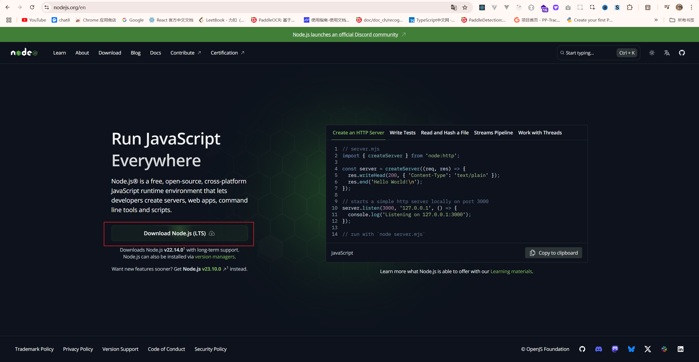
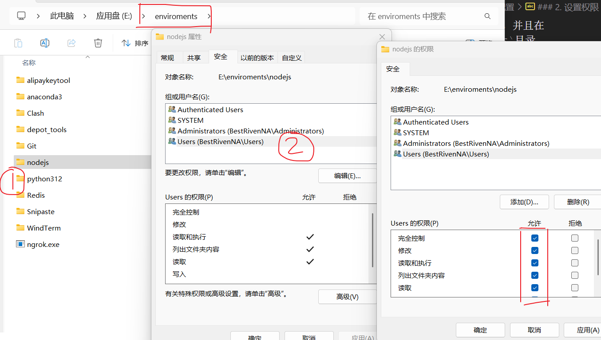
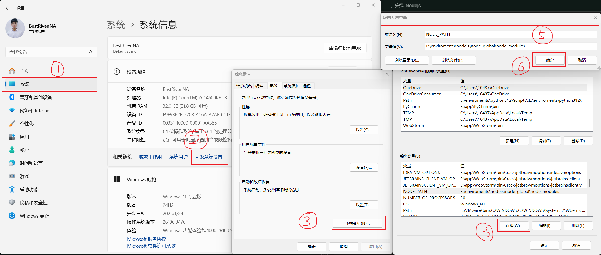
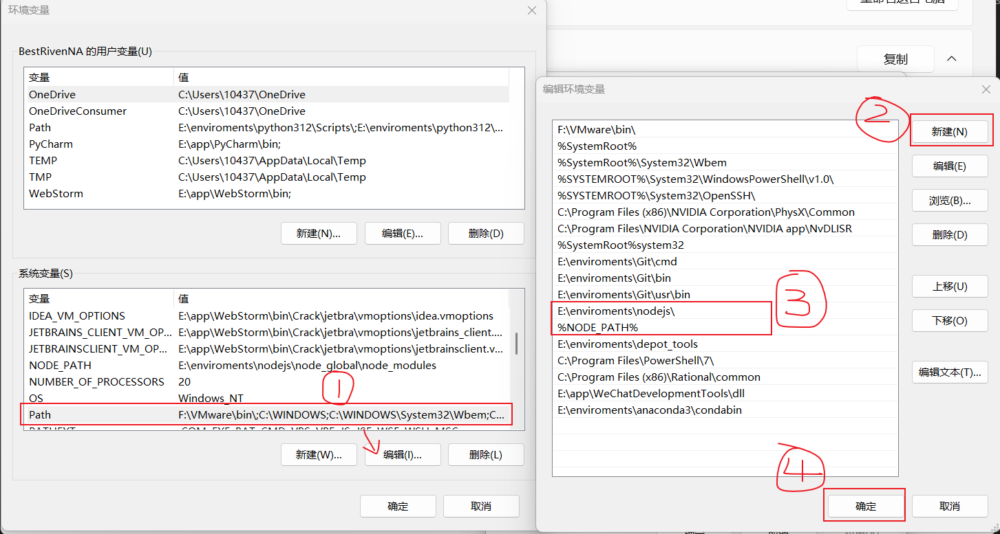
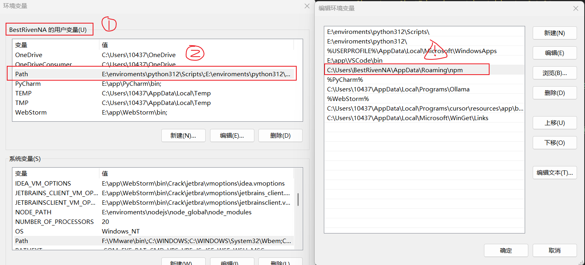
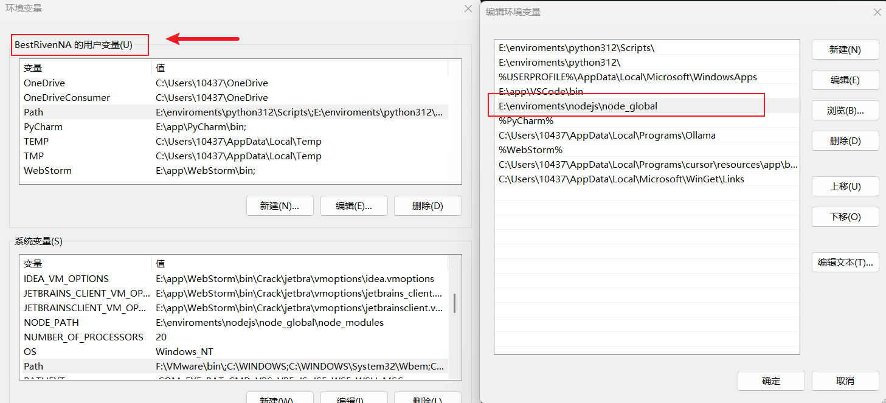
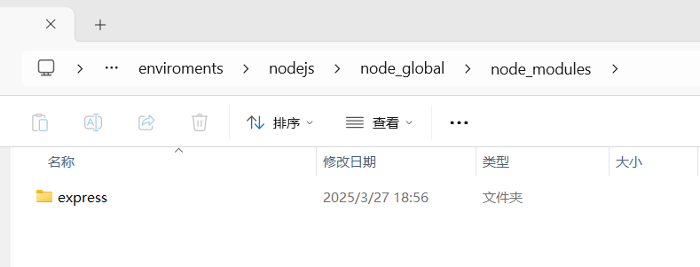

# Nodejs 安装教程

## 一、安装 `Nodejs`

::: info 访问`Nodejs`官网
点击前往：[Nodejs 官网](https://nodejs.org/en)

一直点击下一步安装完即可（可以选择自行选择安装路径）。
:::



- 安装完成后，打开`cmd`，输入`node -v`，如果显示版本号，则安装成功。

```bash
$ node -v
$ npm -v
```

## 二、配置

> 下面拿我的`Nodejs`安装在`E:/enviroments/nodejs/`路径下举例说明：

### 1. 创建目录

创建`node_global`和`node_cache`目录，并且在`node_global`目录下创建`node_modules`目录。

```bash
# 进入 E:/enviroments/nodejs/ 路径下
mkdir -p node_global/node_modules node_cache
```

### 2. 设置权限

设置`nodejs`安装目录权限，右键点击`nodejs`安装目录，选择`属性`，在`安全`选项卡中，点击`编辑`，在`组或用户名`中选择`Users`，点击`编辑`，在`权限`中勾选`完全控制`，点击`确定`。



### 3. 设置`nodejs`的全局和缓存存放路径

```bash
npm config set prefix "E:\enviroments\nodejs\node_global"
npm config set cache "E:\enviroments\nodejs\node_cache"
```

### 4. 系统设置

> 打开系统设置，在`系统变量`中`新建`NODE_PATH`变量，值为`E:\enviroments\nodejs\node_global\node_modules`。



> 继续设置`系统变量`中的`PATH`变量，在`变量值`中添加`E:\enviroments\nodejs\`和`%NODE_PATH%`。



### 5. 设置`用户变量`的`PATH`变量

> 在`用户变量`中设置`PATH`变量，在`变量值`中添加`E:\enviroments\nodejs\node_global\`。

::: warning 注意
将原本的`C:\Users\用户名\AppData\Roaming\npm`路径编辑修改为`E:\enviroments\nodejs\node_global\`。
:::

:warning: 找到下面这个`用户变量`块中的`PATH`变量的值



修改如下，注意是`用户变量`块下的`PATH`变量，而不是`系统变量`块下的`PATH`变量。



## 三、验证设置

- 命令检查配置

```bash
$ npm config get prefix
$ npm config get cache
```

::: warning 注意
如果显示的不是`E:\enviroments\nodejs\node_global`和`E:\enviroments\nodejs\node_cache`，则需要重新设置。
:::

- 全局安装检查配置

```bash
$ npm install -g express
```



::: tip 提示
全局安装包能够存放在`E:\enviroments\nodejs\node_global\node_modules`目录下，则说明配置成功了。
:::

## 四、npm 基本使用

### 初始化项目包

```bash
$ npm init -y
```

### 安装依赖

```bash
$ npm install 包名
```

### 卸载依赖

```bash
$ npm uninstall 包名
```

### 查看安装的依赖

```bash
$ npm list
```

### 安装指定版本

```bash
$ npm install 包名@版本号
```

### 清除缓存

```bash
$ npm cache clean -f
```

### 查看 npm 配置

```bash
$ npm config list
```

### 查看 npm 版本

```bash
$ npm -v
```

::: info 信息：
了解一下 `ES6` 导入和 `CommongJS` 导入区别：[参考教程](https://blog.csdn.net/weixin_43638968/article/details/108871430)
:::

### 1、查看包的所有版本

:::code-group

```bash{1}
$ npm view 包名 versions
```

```bash [例子]{1}
$ npm view bootstrap versions
```

:::

### 2、直接下载最新版本的包

```bash
$ npm install 包名
```

### 3、下载具体版本的包

```bash
$ npm install 包名@版本号
```

### 4、卸载包

```bash
$ npm uninstall 包名
```

### 5、根据 `package.json` 的版本记录一键安装

::: info 说明：

> 进入项目的根目录, 即 `package.json` 所在的目录为根目录, 然后执行下面的命令即可一键安装项目依赖

:::

```bash{1}
$ npm i
```

### 6、使用 `npx` 调用在线工具

:::code-group

```bash [创建 react 项目]{1}
$ npx create-react-app react项目名称
```

```bash [创建 vue 项目]{1}
$ npx create-vue vue项目名称
```

:::

### 7、查看镜像源

```bash
$ npm config get registry
```

### 8、切换镜像源

```bash
$ npm config set registry=https://registry.npm.taobao.org/
```

### 9、检查镜像源

```bash
$ npm config get registry
```
