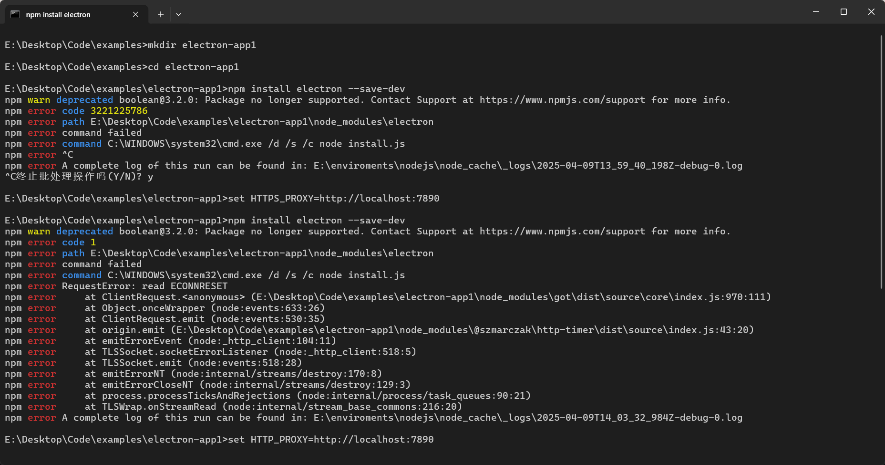
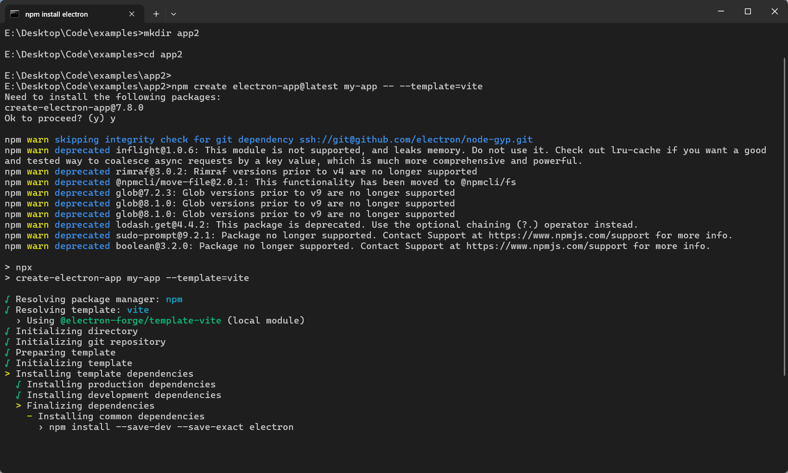
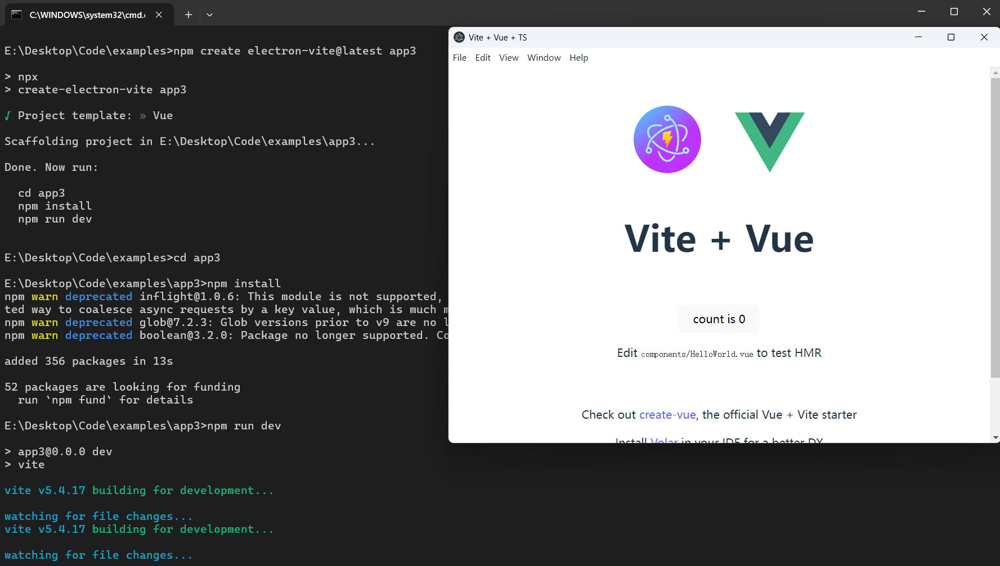
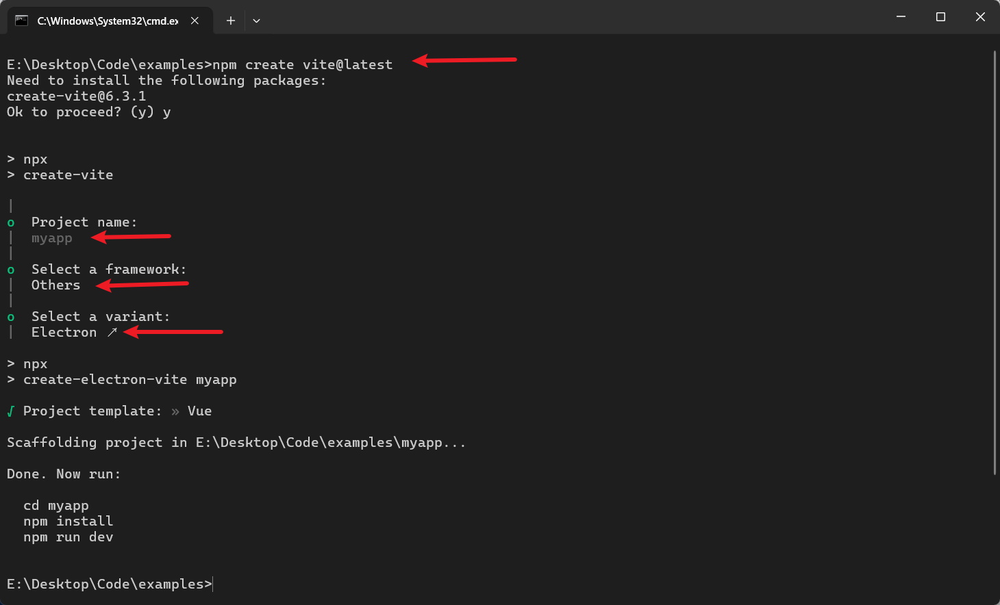
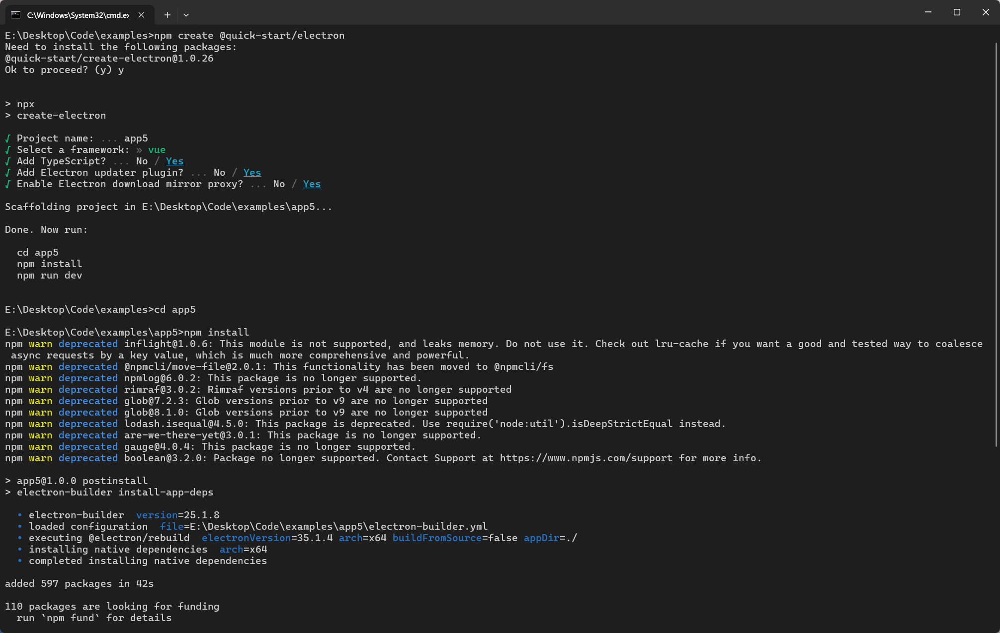
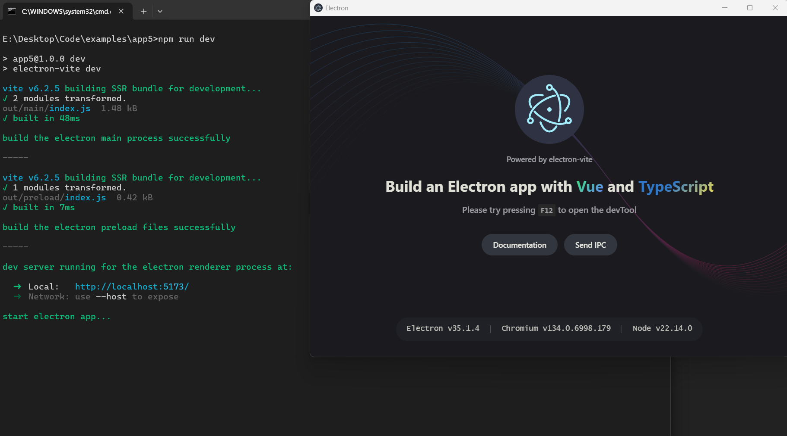
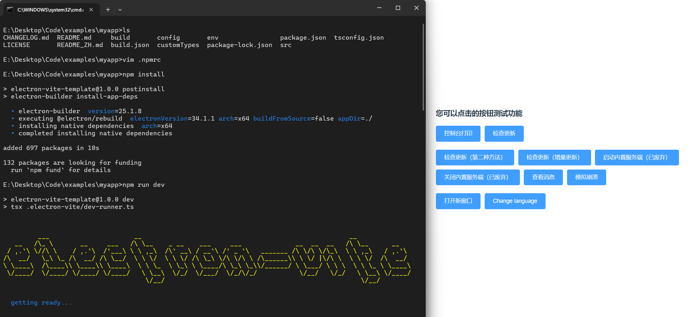

<!--@include: @/public/snippets/preface.md-->

> 本文项目搭建演示的`nodejs`版本如下：

```bash
$ node -v
# v22.14.0
```

## 一、官方文档手动搭建

文档地址：[快速入门 | Electron](https://www.electronjs.org/zh/docs/latest/tutorial/tutorial-first-app)，按照文档步骤操作即可，项目只包含了`electron`依赖，仅仅只是一个`hello world`展示。

> ⚠️ 注意：失败！我设置了代理（网络问题）和切换镜像源（淘宝）等操作都没用。截图如下：



## 二、官方脚手架方式创建

- 创建项目命令如下：

```bash
$ npm init electron-app@latest my-app -- --template=vite  #my-app:项目名(自定义)
# 或
$ npm create electron-app@latest my-app -- --template=vite #my-app:项目名(自定义)
# 或
$ pnpm create electron-app my-app --template=vite  #my-app:项目名(自定义)
```

> ⚠️ 注意：不配置代理，网络不稳定（配置了代理还是等待大半天），等待半天的安装进度，（可能）最后还是大概率会失败！截图如下：



## 三、使用 create electron-vite 脚手架搭建

> 该模板并非`vite`官方提供，而是一位就职于`哈啰`的大神`草鞋没号`提供的。此模板是综合了`electron + vite + ts` 技术的开箱即用的项目模板，目前支持选择`Vue`、`React`、`Vanilla`三种方式的任意一种来直接创建项目。

- 官网: [create-electron-vite](https://electron-vite.github.io/)
- Github 作者: [Github 网址](https://github.com/electron-vite)

- 创建项目命令如下：

```bash
$ npm init electron-vite@latest my-app #my-app 项目名称
# 或
$ npm create electron-vite@latest my-app #my-app 项目名称
# 或
$ pnpm create electron-vite my-app #my-app 项目名称
# 或
$ yarn create electron-vite my-app #my-app 项目名称
```

> ✅ 目前我使用这个模板创建项目和安装依赖、运行项目、打包发布项目等都没有问题，还是挺不错的。项目文档和 github 仓库已经放在上方，大家有问题可以去给作者提 issue。🫡

- 🌟 我这里使用使用`npm create electron-vite@latest app3`演示创建项目，无需代理，如果慢的话，可以尝试切换镜像源。创建项目并运行起来的截图如下：



## 四、使用 vite 官方脚手架创建

- 🌞 备注：使用其他包管理器来搭建项目的同学，自行查看一下 [Vite 官方文档](https://cn.vitejs.dev/guide/) 等价于下面的创建命令方式，此处不再一一说明了哈。

```bash
$ npm create vite@latest
```

- 执行上面的命令后，会提示你输入`项目名称` 、`选择框架类型`（框架类型需要选择`Other`），然后就会回到前面第三种所说的创建方式了。



## 五、使用 electron-vite 工具创建

> npm 仓库：[地址](https://www.npmjs.com/package/@quick-start/create-electron)
> 项目文档：[地址](https://cn.electron-vite.org/)

- 创建项目命令如下：

```bash
$ npm create @quick-start/electron
# 或
$ yarn create @quick-start/electron
# 或
$ pnpm create @quick-start/electron
```

- 可以在创建命令中指定模板：

```bash
# npm 6.x
npm create @quick-start/electron my-app --template vue
# npm 7+, extra double-dash is needed:
npm create @quick-start/electron my-app -- --template vue
# yarn
yarn create @quick-start/electron my-app --template vue
# pnpm
pnpm create @quick-start/electron my-app --template vue
```

- 执行命令后按照提示继续就行：



- 项目搭建完成后启动的截图如下：



## 六、github 上克隆 awesome-vite 中的模板

> 项目仓库：[地址](https://gitcode.com/gh_mirrors/aw/awesome-vite)
> 🤩 上面有非常多的 electron 项目预配置好的模板，大家可以去看看，选择一个适合自己的模板进行克隆。预配置好了像各种路由、状态管理、UI 组件库等完全开箱即用的项目模板。

## 七、使用 electron-vue-template 模板创建

> 这里就举例说明一下，如何使用第六种方式中提到的`awesome-vite`仓库中列举的模板之一`electron-vue-template`来快速创建项目吧。

- 克隆项目命令如下：

```bash
$ git clone https://github.com/umbrella22/electron-vite-template.git myapp #myapp 自定义项目名称
```

- 项目根目录配置`.npmrc`文件

```md
electron_mirror=https://npmmirror.com/mirrors/electron/
electron_builder_binaries_mirror=https://npmmirror.com/mirrors/electron-builder-binaries/
shamefully-hoist=true
```

- 安装依赖

```bash
$ npm install
```

- ⚠️ 尝试设置代理（如果有网络问题）

```bash
# windows
$ set HTTP_PROXY=http://127.0.0.1:7890
$ set HTTPS_PROXY=http://127.0.0.1:7890
# linux
$ export http_proxy=http://127.0.0.1:7890
$ export https_proxy=http://127.0.0.1:7890
```

- 项目运行结果：



该模板相对较完善，依旧使用 `vite` 构建，除此之外还集成了常用的配套库，适用于`electron` + `vue` 技术栈的项目：

- vue-router
- pinia
- electron
- electron-updater
- typescript
- element-plus
- vue
- axios

> 🙏 项目搭建测试和内容整理撰写，花费不少时间，创作不易，转载请注明出处，谢谢！


