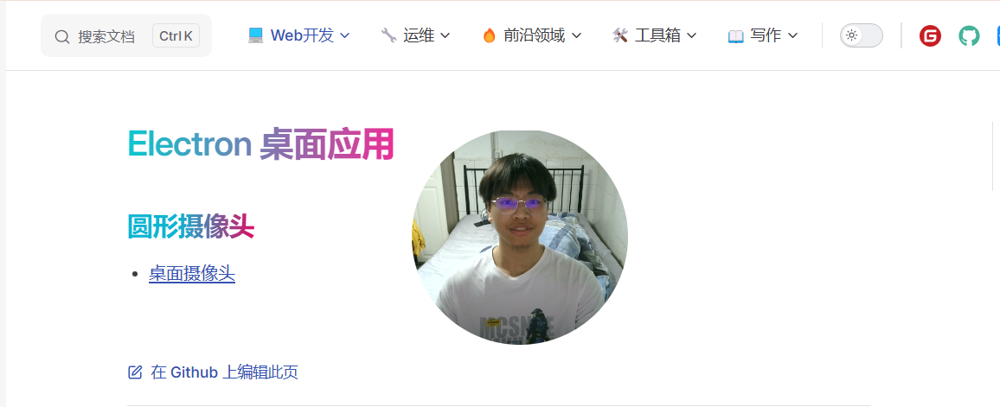

# 桌面摄像头

## 创建项目

```bash
$ npm create electron-vite@latest my-app
```

## 编写代码

- 在 `electron/main.ts` 简单修改一下窗口设置

```ts
function createWindow() {
  win = new BrowserWindow({
    icon: path.join(process.env.VITE_PUBLIC, 'electron-vite.svg'),
    webPreferences: {
      preload: path.join(__dirname, 'preload.mjs'),
    },
    // 新增代码
    autoHideMenuBar: true,
    alwaysOnTop: true,
    frame: false,
    width: 200,
    height: 200,
    x: 0,
    y: 0,
    transparent: true,
    center: true,
    resizable: false,
  })
  // other code...
}
```

- 在 `src/App.vue` 中添加一个圆形摄像头

```vue
<script setup lang="ts">
import { onMounted, ref } from 'vue'
const videoRef = ref<HTMLVideoElement>()

const openCamera = async () => {
  const stream = await navigator.mediaDevices.getUserMedia({
    video: true,
    audio: false,
  })
  videoRef.value!.srcObject = stream
}
onMounted(() => {
  openCamera()
})
</script>

<template>
  <video ref="videoRef" autoplay></video>
</template>

<style scoped lang="css">
video {
  width: 200px;
  height: 200px;
  object-fit: cover;
  border-radius: 50%;
}
</style>
```

## 项目运行

```bash
$ npm run dev
```

## 打包发布

```bash
$ npm run build
```

## 最终效果


